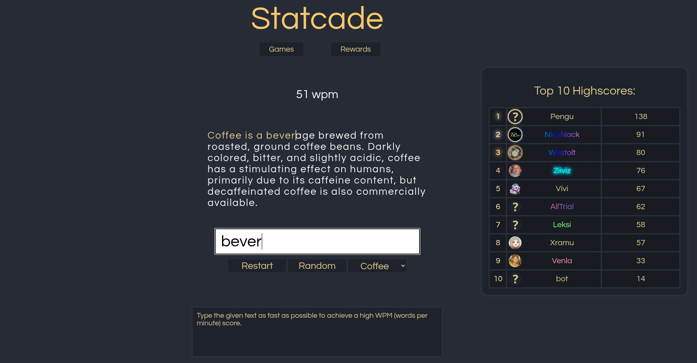
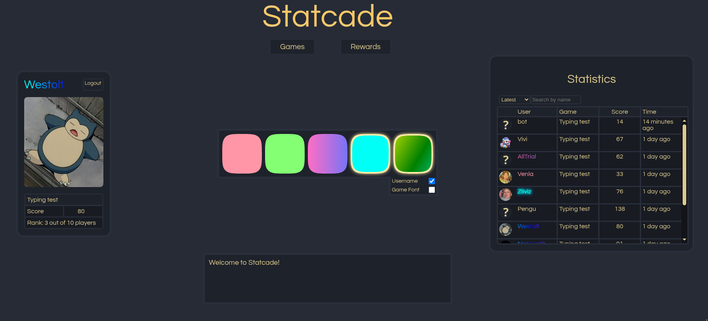
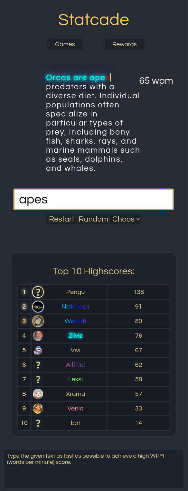

# Statcade

[Live Demo](https://backend-white-bush-6765.fly.dev/)

[Worklog](https://github.com/westolt/Statcade/blob/main/worklog.md)

https://github.com/user-attachments/assets/879a8699-a024-4831-9f85-de07af8d22b2

**Statcade** is a full-stack, web-based arcade platform where users can play mini-games, save their highscores and unlock rewards.

An account is **not required** to play games, but it is needed to save highscores and unlock rewards. 

## Current Games:

- [Typing test](https://github.com/westolt/TypingGame.git) (built with React)

## Tech Stack

**Frontend**
- React (Vite)
- Axios
- CSS

**Backend**
- Node.js with Express
- PostgreSQL
- Sequelize

**Cloud Services**
- Fly.io (deployment)
- Neon.tech (database)
- Cloudinary (profile pictures)

## Features

- User registration and login using token-based authentication
- Users can play games (login not required)
- Highscores are saved after a game ends (requires login)
- Previous highscores are replaced when a new highscore is achieved
- User highscores are visible in the Statistics view
- Statistics list can be sorted by latest, oldest, highest, and lowest scores
- Statistics can be searched by username
- Top 10 highscores are displayed on the Play page for each game
- Reward system where users can unlock and equip rewards
- Currently available rewards change username and game font styles

- TextBox component:
  - Greets the user
  - Shows game and reward information on hover
  - Displays instructions while playing a game
- Users can upload a profile picture (requires login)
  - The uploaded image is automatically set as the profile picture
  - The previous profile picture is deleted from Cloudinary
- Responsive UI supporting different screen sizes (horizontal and vertical)

## Planned Improvements / Not Yet Implemented

- Token expiration
- Improved test coverage
- Slot-based reward selection (currently rewards use shared slots)
- Improved reward list UX
- Admin user roles and permissions
- More detailed statistics for games and users
- Typewriter-style animation for TextBox messages
- Additional games
- Social features (friends, chat, multiplayer invites)
- Custom domain
